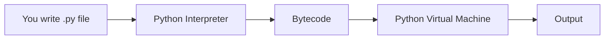

# Introduction to Python

**Module 1 · Lesson 1** | Difficulty: Beginner

<VideoEmbed videoId="YYXdXT2l-Gg" title="Learn Python in One Hour — Beginner Crash Course" />

## What Is Python?

Python is a **high-level, interpreted programming language** known for readability and versatility. Created by Guido van Rossum in 1991, it powers:

- Web applications (Django, Flask, FastAPI)
- Data science and machine learning (pandas, PyTorch, scikit-learn)
- Automation and scripting
- Game development, DevOps, and more

## Why Learn Python?

| Advantage | Explanation |
|-----------|-------------|
| **Readable syntax** | Code reads almost like English |
| **Huge ecosystem** | 400,000+ packages on PyPI |
| **In-demand skill** | Top language for jobs in tech, data, and AI |
| **Gentle learning curve** | Ideal first language for beginners |
| **Runs everywhere** | Windows, macOS, Linux, cloud, embedded |

## Your First Program

Every Python program is a sequence of **instructions** the computer executes top to bottom.

```python
print("Hello, World!")
```

`print()` is a **built-in function** that displays text on the screen. The text inside quotes is a **string** — a sequence of characters.

### More Examples

```python
print(42)           # integers
print(3.14)         # floating-point numbers
print(True)         # boolean (True or False)
print(10 + 5)       # expressions are evaluated first → prints 15
```

## How Python Executes Code



1. You write source code in a `.py` file
2. The **interpreter** reads and compiles it to bytecode
3. The **PVM** executes bytecode line by line
4. Results appear in the terminal or program output

## Comments

Comments are notes for humans — Python ignores them.

```python
# This is a single-line comment

"""
This is a multi-line comment (docstring).
Often used for documentation.
"""

print("This runs")  # inline comment after code
```

## Indentation Matters

Unlike many languages, Python uses **indentation** (spaces) to define code blocks:

```python
if True:
    print("Indented with 4 spaces")  # part of the if block
print("Back to normal level")        # outside the if block
```

:::warning
Always use **4 spaces** per indent level. Mixing tabs and spaces causes errors.
:::

## Key Vocabulary

| Term | Meaning |
|------|---------|
| **Variable** | Named container for data |
| **Function** | Reusable block of code |
| **Expression** | Code that produces a value (`2 + 3`) |
| **Statement** | Instruction that does something (`x = 5`) |
| **Interpreter** | Program that runs Python code |

## Practice

Apply what you learned in the interactive notebook.

[](https://colab.research.google.com/github/Saidsp19/cognitive-vidya/blob/main/notebooks/python-course/01-fundamentals/01-introduction.ipynb)

<LessonProgress lessonId="python/fundamentals/introduction" />

**Next:** [Setting Up Python](./setup)
